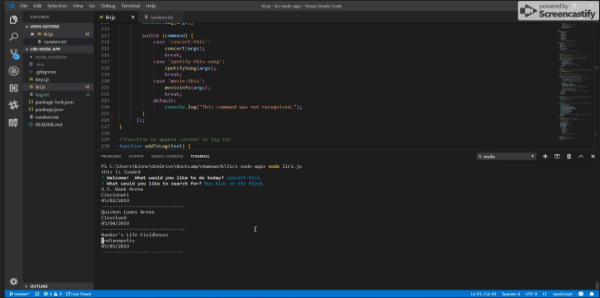

# liri-node-app
This command line node app uses inquirer to take in parameters and return requested data from the Spotify, Bands in Town, and OMDB APIs.  Liri also has the capability to read a command from a text file and log commands and resutls.

### Developed by: Sarah Kinneer
#### January, 2019

## Technologies Used:
JavaScript, jQuery, Node.js, Moment.js, Inquirer, Dotenv, Axios, Spotify API, Bands in Town API, OMDB API

## View Full Demonstration Video:
- [Demonstration GIF](./liri-demo.gif)

## You may clone this repository to download the app:
To use this app, you must register for an API key from Spotify and create a .env file containing the following:

##### \# Spotify API keys

##### SPOTIFY_ID=Your Spotify ID Goes Here
##### SPOTIFY_SECRET=Your Secret Key Goes Here

If they are not already installed, you will need to install dotenv, node-spotify-api, axios, moment, fs, and inquirer using the npm install command in order for the app to work properly.

## Use:
1. Make sure you are in the correct directory, then run the app by typing node liri.js in the terminal.
2. You will be prompted to choose an action and then prompted to enter your search terms:
   - 'concert': search for upcoming concerts of a requested band/artist
   - 'spotify-this-song': search for a requested song track on Spotify
   - 'movie-this': search for information about a requested movie
   - 'do-what-it-says': follow the query terms given in the random.txt file
3. After you input your search terms, the requested data will be logged to the screen and to the log.txt file
4. Finally, you will be prompted to either Search again or Exit the application
